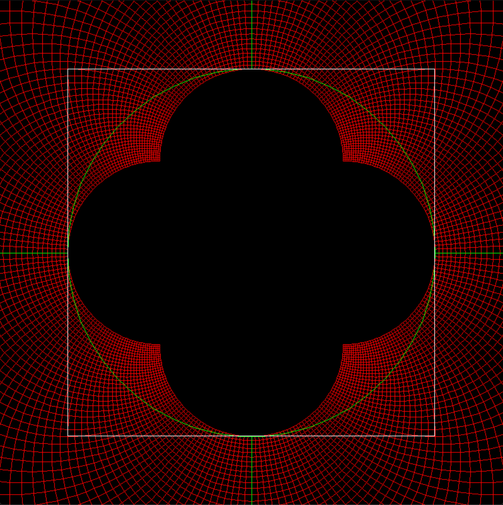

# ConformalViz
Visualizing conformal mappings in Rust

Fun way to play with visualizing conformal mappings in rust. 

To run:

- Install Rust (great language, great balance between high level and low, formal and workable): https://www.rust-lang.org/tools/install
- Clone the repository `git clone git@github.com:Renmusxd/ConformalViz.git`
- Navigate to new directory and run `cargo run --release` which will download the required libraries, build them all, and run the application.

To zoom in/out use the up/down keys

Example of 1/z with unit circle |z| = 1, x axis, and y axis in green. Then output unit square (|Re(w)|=1 or |Im(w)|=1) in white.

